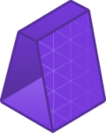

# Azure Quantum #

[/_apis/build/status/microsoft.qdk-python?branchName=main)](https://dev.azure.com/ms-quantum-public/Microsoft%20Quantum%20(public)/_build/latest?definitionId=32&branchName=main) [](https://badge.fury.io/py/azure-quantum)

Azure Quantum is Microsoft's cloud service for running Quantum Computing programs or solving Optimization problems with our quantum partners and technologies. The `azure-quantum` package for Python provides functionality for interacting with Azure Quantum workspaces,
including creating jobs, listing jobs, and retrieving job results.

## Installation and getting started ##

For details on how to get started with Azure Quantum, please visit the [Azure Quantum Documentation](https://azure.com/quantum).

To learn more about Quantum Computing and the kinds of problems that can be solved, take a look at our [Quantum Computing Fundamentals](https://aka.ms/learnqc) learning path to get familiar with the basic concepts of quantum computing and how to build quantum programs.

## Quickstart ##

### Prerequisites ###

1. To work in Azure Quantum, you need an Azure subscription. If you don't have an Azure subscription, create a [free account](https://azure.microsoft.com/free/).

2. Create an Azure Quantum Workspace and enable your preferred providers. For more information, see [Create an Azure Quantum workspace](https://docs.microsoft.com/en-us/azure/quantum/how-to-create-workspace).

### Install ###

The package is released on PyPI and can be installed via `pip`:

```bash
pip install azure-quantum
```

### Connect to Azure Quantum ###

To connect to your Azure Quantum Workspace, go to the [Azure Portal](https://portal.azure.com), navigate to your Workspace and copy-paste the resource ID and location into the code snippet below.

```python
from azure.quantum import Workspace

# Enter your Workspace details (resource ID and location) below.
workspace = Workspace(
    resource_id="",
    location=""
)
```

### Quantum Computing example ###

Below is a simple example to get you started with [Quantum Computing](https://docs.microsoft.com/azure/quantum/overview-qdk).

```python
# Connect to a Quantum Computing target
target = workspace.get_targets(name="ionq.simulator")

# Simple program to create a Bell state
program = {
    "qubits": 3,
    "circuit": [
        {
            "gate": "h",
            "target": 0
        },
        {
            "gate": "cnot",
            "control": 0,
            "target": 1
        }
    ]
}
job = target.submit(program)

# Wait until job is done and fetch results
results = job.get_results()

print(results)
```

### Optimization example ###

Below is a simple example to get you started with [Optimization](https://docs.microsoft.com/azure/quantum/optimization-what-is-quantum-optimization).

```python
from azure.quantum import Workspace
from azure.quantum.optimization import Problem, ProblemType, Term

# Enter your Workspace details (resource ID and location) below.
workspace = Workspace(
    resource_id="",
    location=""
)

# Connect to an Optimization target
target = workspace.get_targets(name="")
problem = Problem(name="My First Problem", problem_type=ProblemType.ising)
problem.add_terms(terms=[
    Term(c=-9, indices=[0]),
    Term(c=-3, indices=[1,0]),
])
job = target.submit(problem)

# Wait until job is done and fetch results
results = job.get_results()

print(results)
```

## Development ##

The best way to install all the Python pre-reqs packages is to create a new Conda environment.
Run at the root of the `azure-quantum` directory:

```bash
conda env create -f environment.yml
```

Then to activate the environment:

```bash
conda activate azurequantum
```

In case you have created the conda environment a while ago, you can make sure you have the latest versions of all dependencies by updating your environment:

```bash
conda env update -f environment.yml --prune
```

### Install the local development package ###

To install the package in development mode, run:

```bash
pip install -e .
```

### Unit tests ###

To run the unit tests, run `pytest` from the root of the `azure-quantum` directory:

```bash
pytest
```

To run the a specific unit test class, run:

```bash
pytest ./tests/unit/test_job.py
```

To run the a specific unit test case, run:

```bash
pytest -k test_job_refresh
```

#### Recordings ####

To read more about how to create and update recordings for testing code that interacts with a live API, see the [Unit tests README](./tests/README.md).

## Building the `azure-quantum` Package ##

The Azure Quantum Python SDK uses a standard `setuptools`-based packaging strategy.
To build a platform-independent wheel, run the setup script with `bdist_wheel` instead:

```bash
python setup.py bdist_wheel
```

By default, this will create a `azure-quantum` wheel in `dist/` with the version number set to 0.0.0.1.
To provide a more useful version number, set the `PYTHON_VERSION` environment variable before running `setup.py`.

## Environment Variables ##

In addition to the [common Azure SDK environment variables](https://azure.github.io/azure-sdk/general_azurecore.html#environment-variables), you can also set the following environment variables to change the behaviour of the Azure Quantum SDK for Python:
| Environment Variable             | Description                                                            |
| -------------------------------- | ---------------------------------------------------------------------- |
| AZURE_QUANTUM_PYTHON_APPID       | Prefixes the HTTP User-Agent header with the specified value           |

## Support and Q&A ##

If you have questions about the Quantum Development Kit and the Q# language, or if you encounter issues while using any of the components of the kit, you can reach out to the quantum team and the community of users in [Stack Overflow](https://stackoverflow.com/questions/tagged/q%23) and in [Quantum Computing Stack Exchange](https://quantumcomputing.stackexchange.com/questions/tagged/q%23) tagging your questions with **q#**.
